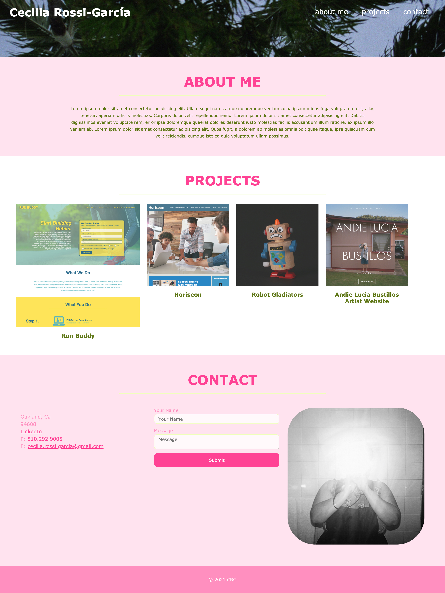

# Portfolio Challenge

## User Story
* An employer would like to view a potential employee's deployed portfolio of work samples so they can review the work and asses whether they are a good candidate for the position.

## Acceptance Criteria
* Ability to load the portfolio and be presented with the developer's name, a recent photo, links to sections about them, their work and how to contact them.
* Links in navigation scroll to corresponding sections.
* The section with the developer's work has titled images of the developer's applications.
* Developer's first application image is larger than the others.
* When application images are clicked you are taken to that deployed application.
* Page has a responsive layout that adapts to user's viewport.

## Solution
* Used HTML anchor elements for navigation and application links
* Used media queries to add mobile responsiveness
* Used flexbox to layout the different sections 

## Website
https://crossigarcia.github.io/portfolio/

## Screenshot of Website  

